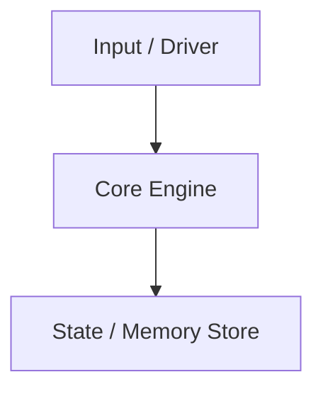

# Build Log: {{project}}

> [!INFO] Project Info
> - **Spec:** `{{spec}}` — the requirements and "Done when" list live there; this note is your working log.
> - **Git Repository:** `{{repo_link}}`
> - **Status:** `{{status}}`
> - Dates live in git history and your session log, not here ([Frontmatter Schema](<Frontmatter Schema.md>)).

---

## 🎯 Objective & Requirements
*What does this system do? Copy the hard requirements from the spec in your own words.*

---

## 🏗️ Architecture & Component Design
*Data structures, memory layouts, algorithms, protocols, or state machines.*

---

## 🔬 Invariants & Representation
- **Representation Invariants (RI):**
  - 
- **Abstraction Function (AF):**
  - 

---

## 🧪 Verification & Test Strategy
- [ ] Unit tests written before implementation
- [ ] Edge cases (empty, overflow, max limits)
- [ ] Memory leaks / Valgrind clean (`valgrind --leak-check=full`) — C projects
- [ ] Race detection (ThreadSanitizer) — concurrent projects
- [ ] The whole suite runs with one command

---

## 🛠️ Build Log & Bugs Encountered
*Document the hardest bugs and how they were diagnosed (printf, gdb, objdump, logic analyzer). Stuck notes [D] go here too.*

---

## ✅ Milestone Checkpoints
*One [Milestone Checkpoint](<Milestone Checkpoint Template.md>) per milestone in the spec (R + F + W).*
