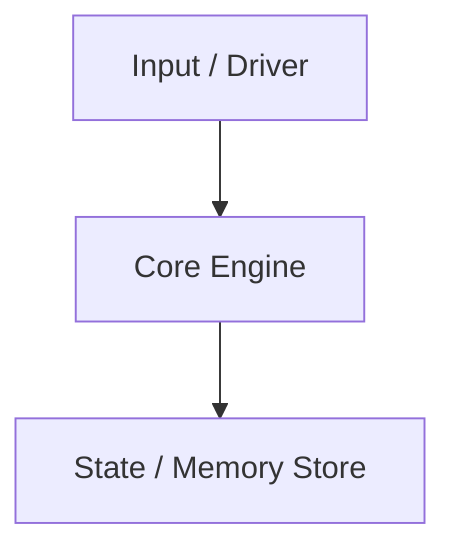

# Project Spec: {{project_name}}

> [!INFO] Project Info
> - **Associated Block:** `{{associated_block}}`
> - **Git Repository:** `{{repo_link}}`
> - **Status:** `{{status}}`

---

## 🎯 Objective & Requirements
*What does this system do? What are the hard requirements from the block?*

---

## 🏗️ Architecture & Component Design
*Data structures, memory layouts, algorithms, protocols, or state machines.*

---

## 🔬 Invariants & Representation
- **Representation Invariants (RI):**
  - 
- **Abstraction Function (AF):**
  - 

---

## 🧪 Verification & Autograder Test Strategy
- [ ] Unit tests written before implementation
- [ ] Edge cases (empty, overflow, max limits)
- [ ] Memory leaks / Valgrind clean (`valgrind --leak-check=full`)
- [ ] Race detection (`go test -race` or ThreadSanitizer)
- [ ] Autograder / Benchmark score:

---

## 🛠️ Build Log & Bugs Encountered
*Document the hardest bugs and how they were diagnosed (printf, gdb, objdump, logic analyzer).*
